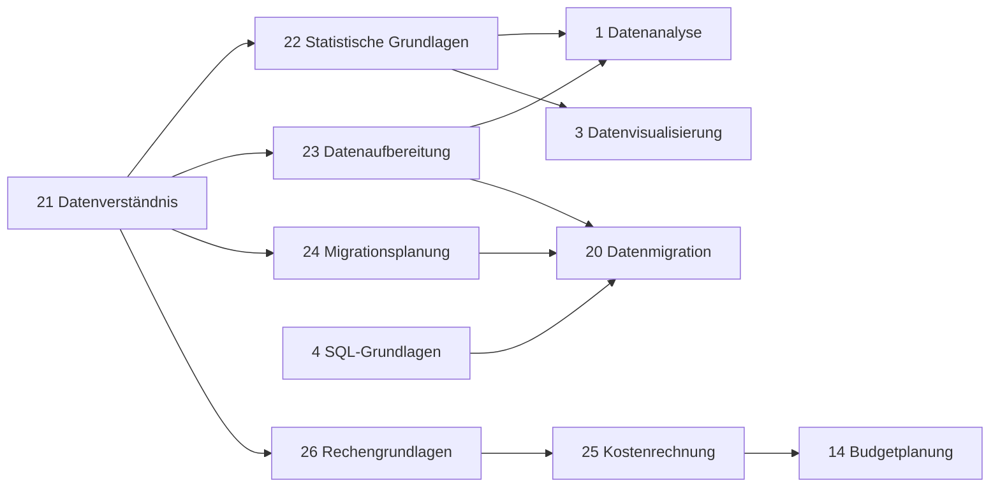

# Use-Cases und bestätigte Entscheidungen

**Stand:** 18.09.2026 – eingefrorener fachlicher Ausgangsstand.  
**Geltung:** Ergänzung zum [Anforderungskatalog_16092026.xlsx](Anforderungskatalog_16092026.xlsx). Anforderungen und Prioritäten stehen im Katalog; dieses Dokument konkretisiert Bedienabläufe und Abnahmebeispiele. Es ist kein Auftrag für eine weitere Konzeptionsrunde.

## 1. Verbindliche Leitlinien

- Das MVA wertet vorbereitete Daten aus; keine Datenpflegeoberfläche, neue LLM-Schätzung oder persistente Simulation (D-06/D-10, A-13/A-15).
- Taxonomie: aufklappbares Inhaltsverzeichnis mit Skill-Listen für Gruppen ohne Untergruppen. Der Taxonomiegraph entfällt vollständig aus dem aktuellen Umfang (F-02). Ein separater Entwicklungs-DAG bleibt erhalten.
- Organisationsmaske bestimmt den Ausschnitt; Mitarbeitermaske bestimmt dessen personenbezogene Bewertung. Beide Masken bilden **keine Vereinigung** aus Soll-Skills und zusätzlichen persönlichen Ist-Skills (F-04/F-11).
- Dashboard und Kategorieübersichten bleiben organisationsbezogen. Personenauswahl und reine Ansichtswechsel ändern deren Zahlen nicht (A-06/F-11).
- Fachliche Regeln gelten auch für nicht aufgeklappte Inhalte und für Skills, die nur in Listen angezeigt werden (F-06).
- Gemeinsamer Akteur ist der Nutzer, der die Kompetenzsituation untersucht. Daraus entsteht kein zusätzliches Rollenmodell.

## 2. Korrigierte Regel: geschätzte Skills und Pfadverfügbarkeit

**Verbindlicher Bezug: D-07, D-10 und S-01.**

Ein Skill gilt als geschätzt, wenn mindestens eine der folgenden Bedingungen erfüllt ist:

1. Er gehört zum ursprünglichen Soll-Bestand: Er ist im ungefilterten gespeicherten Aufgabenbestand direkt einer Aufgabe zugeordnet **oder eine direkte beziehungsweise indirekte Voraussetzung eines solchen Skills**.
2. Für ihn ist mindestens eine eigene Voraussetzung gespeichert, also mindestens ein Datensatz mit diesem Skill als `skill_id` in `skill_prerequisite` vorhanden.

Die Voraussetzungen in Bedingung 1 werden vollständig und über beliebig viele vorhandene Ebenen verfolgt. Die Schätzung ist eine Eigenschaft der vorbereiteten Daten. Sie hängt weder von aktuell eingeschlossenen Aufgaben noch von Simulationsfiltern oder Masken ab.

Damit gelten **auch implizite Soll-Skills ohne eigene Voraussetzungen als geschätzte Grundlagenskills**. Ihr allgemeiner DAG besteht aus dem Zielknoten. Sie erhalten bei roter oder gelber Soll-Bewertung regulär Entwicklungskandidaten und Distanzen. Die zuvor beschriebene Ausnahme für ausschließlich als Voraussetzung vorkommende Grundlagenskills ist aufgehoben.

Trifft keine Bedingung zu, öffnet ein Pfadaufruf keinen DAG, sondern eine kurze schließbare Warnbox, beispielsweise „Für diesen Skill liegt kein geschätzter Entwicklungspfad vor.“ Die vorherige Ansicht bleibt zugänglich. Fehlende Daten außerhalb des geschätzten Bestands werden nicht als bekannte Voraussetzungslosigkeit interpretiert.

**Abnahmebeispiel:** Eine Aufgabe benötigt Z; Z benötigt B; B benötigt A; A hat keine Voraussetzungen. Z, B und A gelten sämtlich als geschätzt. A kann als einzelner Zielknoten geöffnet werden. Nach Ausschluss der Aufgabe bleiben alle drei Skills geschätzt, auch wenn sie dadurch nicht mehr zum aktuellen Soll gehören. Ein anderer katalogisierter Skill Q ohne Aufgabenbezug, ohne Zugehörigkeit zu dieser Voraussetzungshülle und ohne eigene gespeicherte Voraussetzungen erhält beim Pfadaufruf die Warnbox.

## 3. Rechen- und Darstellungsbeispiele

### Distanz einschließlich Zielskill

S-02 zählt alle eindeutigen fehlenden Skills aus Zielskill und Voraussetzungen. Die Besitzmenge der Person enthält ihre impliziten Voraussetzungen. Gruppen zählen nicht mit. Die Distanz ist keine Kantenlänge.

Beispiel: Z benötigt A und B; A und B haben keine weiteren Voraussetzungen.

| Besitz der Person | Distanz zu Z |
|---|---:|
| Keiner der Skills | 3 |
| Nur A | 2 |
| A und B | 1 |
| Z vorhanden, damit A und B implizit vorhanden | 0 |

### Verbleibender personenbezogener DAG

S-05 lässt alle fehlenden Skills und unmittelbar davorliegende vorhandene Anschlussknoten sichtbar. Die Kürzung geschieht pro Zweig, nicht auf insgesamt einen vorhandenen Knoten beschränkt.

Beispiel: E benötigt C und D; C benötigt A; D benötigt B. A besitzt X, Y und Z als direkte oder indirekte Voraussetzungen. Schulze besitzt A und damit X, Y und Z; B, C, D und E fehlen. Weitere Voraussetzungen von B sind für dieses Beispiel nicht gegeben.

| Ansicht | Sichtbare Skills | Distanz zu E |
|---|---|---:|
| Verbleibend | A als vorhandener Anschlussknoten; B, C, D, E als fehlend | 4 |
| Vollständig | Zusätzlich X, Y, Z als vorhanden | 4 |

„Vollständig“ bei Personenbezug behält die Besitzfarben bei. „Allgemein“ hat keinen Personenbezug (S-06/S-07).

### Kandidaten und zwei unabhängige Empfehlungsgründe

A-11/A-12 sehen drei Plätze vor; unbesetzte Plätze sind keine Personen und bekommen keine erfundene Distanz. Bei Gelb ist der einzige Wissensträger ausgeschlossen. Simulativ ausgeschlossene Personen sind ebenfalls keine Kandidaten.

| Zulässige Kandidaten und Distanzen | Erwartetes Ergebnis |
|---|---|
| Zwei Personen: 1, 2 | Ein unbesetzter Platz löst eine Handlungsempfehlung aus; Distanzschwelle greift nicht |
| Drei Personen: 1, 2, 4 | Kein unbesetzter Platz; kleinste Distanz unter 3; keiner der beiden Auslöser greift |
| Drei Personen: 3, 4, 5 | Hinweis auf Prüfung zusätzlichen Personaleinsatzes oder externer Fertigkeitsgewinnung |
| Keine Person | Unbesetzte Plätze lösen die Empfehlung aus; keine kleinste Distanz berechnen |

## 4. Oberfläche und Zustände

Der Seitenrahmen besteht aus oben fixierter Navigation mit Organisationseinheits-Dummy und „Start“, darunter Dashboard, wechselndem Mainframe und einfachem Footer. Dashboardzahlen und Kategorienamen sind anklickbar. Zahlen müssen auch vierstellig lesbar sein; es gibt keine fachliche Obergrenze von vier Stellen.

Der Mainframe hat eine feste Darstellungsfläche; etwa 1440 × 900 Pixel beziehungsweise 16:10 sind die genannte Entwurfsgröße, keine verbindliche Mindestbildschirmauflösung. Inhaltsverzeichnis und Listen werden innerhalb des Bereichs gescrollt. Der Entwicklungs-DAG kann innerhalb des Mainframes verschoben und gezoomt werden. Aus alten Taxonomiezeichnungen entsteht keine Pflicht für Zoom- oder Verschiebefunktionen im Inhaltsverzeichnis.

Masken- und Simulationssymbole zeigen ihren Zustand und erhalten kurze Hover-Infotexte. Eine zusätzliche dauerhafte Statuszeile ist nicht festgelegt. Leere Listen zeigen schlicht „Leere Liste“.

| Organisationsmaske | Person | Zugänglicher Skillbestand und Bewertung |
|---|---|---|
| Aktiv | Keine | Aktuelle Soll-Skills; Organisationsbewertung |
| Inaktiv | Keine | Gesamter Katalog; Organisationsbewertung nur für aktuelle Soll-Skills |
| Aktiv | Ausgewählt | Aktuelle Soll-Skills; persönlicher Besitz grün/rot |
| Inaktiv | Ausgewählt | Gesamter Katalog; persönlicher Besitz grün/rot |

Bei fehlendem Soll bleibt der gesamte Katalog zugänglich (F-08). Die oberste Gruppenebene ist beim Start vollständig sichtbar; tiefere Gruppen sind eingeklappt. Die Organisationsfarbe wird unabhängig vom Aufklappzustand mit Rot vor Gelb vor Grün über relevante Nachfahren vererbt.

| Aktion | Bedeutung |
|---|---|
| Zurück | Tatsächlich vorherige Mainframe-Ansicht; Kontext und Filter erhalten |
| Reset | Nur Ansicht zurücksetzen; keine fachlichen Masken oder Simulationsfilter ändern |
| Start | Vollständiger Ausgangszustand und nach oben scrollen |

Der Ausgangszustand umfasst die echte Organisationseinheit, alle Aufgaben und Mitarbeitenden, aktive Organisationsmaske, keine ausgewählte Person und die initiale Taxonomieansicht. Nach Schließen und erneutem Öffnen der Webseite gilt ebenfalls dieser Zustand. Das Schließen des Simulationsmenüs verwirft keine Filter.

## 5. Use-Cases für Umsetzung und Abnahme

Die folgenden Abläufe referenzieren den Katalog. Sie erzeugen keine zusätzlichen Anforderungs-IDs.

| ID und Ziel | Ablauf | Erwartetes Ergebnis und Bezug |
|---|---|---|
| UC-01: Anwendung öffnen | Seite öffnen; Ausgangszustand herstellen; Soll/Ist auswerten; Dashboard und Inhaltsverzeichnis anzeigen | Echte Organisation vorausgewählt, tiefere Gruppen eingeklappt. Dashboard zählt eindeutige aktuelle Soll-Skills. G-04/G-05, F-03/F-04/F-08/F-09, A-01–A-06 |
| UC-02: Gruppen und Skills erkunden | Gruppen auf-/zuklappen; Gruppe ohne Untergruppen auswählen; Skill-Liste im Mainframe lesen; zurückgehen | Gruppenname und Status sowie Skillbewertungen sichtbar; Kontext und Filter bleiben erhalten. Eingeklappte rote Skills beeinflussen weiterhin ihre Vorfahrengruppen. F-02/F-06/F-07, S-08 |
| UC-03: Organisationsmaske wechseln | Maske aus-/einschalten | Gesamter Katalog beziehungsweise aktueller Soll-Ausschnitt. Person und Simulation bleiben erhalten; Dashboardzahlen unverändert. F-04/F-10, A-06 |
| UC-04: Person auswählen | Eine Person wählen, wechseln oder über Keiner abwählen | Aktueller Ausschnitt erhält persönliche Besitzbewertung beziehungsweise wieder Organisationsbewertung. Keine Erweiterung durch zusätzliche Ist-Skills; Dashboard und Kategorieübersichten bleiben organisationsbezogen. F-11, D-08 |
| UC-05: Kategorie öffnen | Dashboardzahl oder Kategoriename anklicken | Grün: Mitarbeitertabelle mit grünen Soll-Skills; Gelb/Rot: aufklappbare Skill-Details. Gelb zeigt einzigen Wissensträger. Zurück stellt vorherige Ansicht her. A-06–A-08/A-17, S-08 |
| UC-06: Kandidaten prüfen | Rotes/gelbes Skilldetail öffnen; Kandidaten, Distanzen und Empfehlungen betrachten; Person anwählen | Höchstens drei reale Kandidaten, unbesetzte Plätze erkennbar; Sortierung und Empfehlungen wie Abschnitt 3. Personenlink öffnet verbleibenden DAG. A-09–A-12/A-17, S-02–S-04/S-09 |
| UC-07: Allgemeinen DAG öffnen | Skill ohne Person öffnen oder im DAG Allgemein wählen | Verfügbarkeitsprüfung nach Abschnitt 2; vollständiger DAG mit Zielskill oder Warnbox. Keine persönliche Besitzbewertung. Organisationsmaske entfernt keine Voraussetzungen. S-01/S-07 |
| UC-08: Personenbezogenen DAG erkunden | Skill mit Person oder Kandidatenlink öffnen; Verbleibend/Vollständig umschalten; Person wechseln oder Allgemein wählen | Kürzung pro Zweig; vollständige Ansicht behält Personenfarben. Distanz bleibt bei Darstellungswechsel gleich. D-08, S-04–S-07 |
| UC-09: Ausfall simulieren | Simulationssymbol öffnen; Aufgaben/Personen aus- oder wieder einschließen; Menü schließen; weitere Ansichten öffnen | Alle Ergebnisse verwenden denselben Filterzustand; keine Datenänderung. Ausgeschlossene Person ist weder Wissensträger noch Kandidat. G-15, A-01/A-09/A-13/A-15/A-16 |
| UC-10: Navigieren und zurücksetzen | Zurück, Reset oder Start auslösen | Unterschiedliche Wirkungen gemäß Abschnitt 4. DAG aus Skill-Liste führt zurück zur Liste; DAG aus Kandidatenübersicht zurück zu dieser Übersicht. S-08, G-15 |

### Technischer Stand zu UC-01: Kernberechnung (Schritt 3)

Implementierter Anteil: D-07, D-08, A-01 bis A-05; leere Mengen gemäß F-09, eindeutige Zählung gemäß G-09, UND-Verknüpfung gemäß G-13 und Ablehnung von Zyklen gemäß G-12. Dies ist die berechnete Grundlage für UC-01; Dashboard, Taxonomieoberfläche und deren vollständige Abnahme folgen später.

`GET /api/analysis` (lokal `http://localhost/skilltree/public/api/analysis`) berechnet den ungefilterten Ausgangszustand der genau einen vorbereiteten Organisationseinheit. Es gibt in diesem Schritt keine Abfrageparameter für Masken, Personenwahl oder Simulation. Alle Aufgaben und Mitarbeitenden dieser Einheit fließen ein. PDO lädt die direkten Zuordnungen und globalen Voraussetzungen innerhalb einer konsistenten Lesetransaktion; die Fachberechnung erzeugt daraus den Ergebnisstand. Es werden keine impliziten Zuordnungen oder Ergebnisse gespeichert (A-15/A-16).

| Antwortfeld | Bedeutung |
|---|---|
| `organisation` | ID und Name der vorbereiteten Einheit |
| `summary` | Anzahl Aufgaben, Mitarbeitende, eindeutige Soll-/Ist-Skills und Ampelzahlen in der Reihenfolge `red`, `yellow`, `green` |
| `required_skill_ids` | Eindeutige Soll-Skills einschließlich aller Voraussetzungen |
| `available_skill_ids` | Vereinigung der Skillbestände aller Mitarbeitenden einschließlich Voraussetzungen, auch außerhalb des Solls |
| `skills` | Eine Zeile pro Soll-Skill: `id`, `name`, `skill_group_id`, `carrier_count`, `employee_ids`, `status` |
| `tasks` | ID, Name, `direct_skill_ids` und vollständig hergeleitete `required_skill_ids` je Aufgabe |
| `employees` | ID, Vor-/Nachname, `direct_skill_ids` und vollständig hergeleitete `available_skill_ids` je Person |

Skill-ID-Mengen und die Soll-Skillliste sind numerisch nach ID sortiert. Die Gruppen-ID dient nur der thematischen Zuordnung und wird nicht als Skill gezählt. `employee_ids` macht die eindeutige Trägerzählung nachvollziehbar. `status` lautet `red` bei 0, `yellow` bei 1 und `green` ab 2 Personen. Ist-Skills außerhalb des Solls beeinflussen die Ampelzahlen nicht.

Beispiel für den um einen DAG erweiterten synthetischen Datensatz (Ausschnitt aus der HTTP-200-Antwort):

```json
{
  "summary": {
    "task_count": 10,
    "employee_count": 5,
    "required_skill_count": 26,
    "available_skill_count": 23,
    "counts": { "red": 3, "yellow": 7, "green": 16 }
  }
}
```

Konkrete Prüfwerte: Datenanalyse (ID 1) hat Träger `[1, 2, 4]` und ist grün; Budgetplanung (ID 14) hat Träger `[1]` und ist gelb; Krisenkommunikation (ID 19) und Datenmigration (ID 20) haben jeweils `[]` und sind rot.

Automatisiertes Vererbungsbeispiel aus Abschnitt 2: Die Aufgabe verlangt Z; Z benötigt B; B benötigt A. Besitzt eine Person B, ergeben sich Soll `{A, B, Z}`, Ist `{A, B}` und Ampel 1 rot / 2 gelb / 0 grün. Mehrere Besitzwege und mehrere Aufgaben zählen einen Skill weiterhin nur einmal. Die Voraussetzungen dieses Beispiels existieren nur im Testprozess und werden nicht in den vereinbarten Datenbankbestand eingefügt.

Fehlerfälle: HTTP 409 mit `error.code = invalid_dataset` bei fehlender/mehrdeutiger Organisation, unbekannten Skillreferenzen oder zyklischen Voraussetzungen; HTTP 503 mit `error.code = database_unavailable` bei fehlender Konfiguration oder Datenbankfehler. Fehlerantworten enthalten keine Teilberechnung oder Zugangsdaten. Alle Analyseantworten verwenden `Cache-Control: no-store`.

Prüfung: `composer test` für die Fach- und HTTP-Tests ohne Datenbank; `composer test:database` für den lesenden Abgleich des lokalen 26-Skill-Seeds einschließlich der indirekten Soll-/Ist-Skills. Vollständige Aufrufanleitung und geprüfte Ergebnisse stehen in der README.

### Ergänzter Test-DAG: indirekte Soll- und Ist-Skills

Auf ausdrücklichen Nutzerwunsch wurde der ursprüngliche Testbestand um sechs Skills (IDs 21 bis 26) und zwölf Kanten ergänzt. Die ursprünglichen direkten Zuordnungen bleiben erhalten; keiner der sechs neuen Skills erhält eine direkte Aufgaben- oder Mitarbeiterzuordnung. Der vollständige Seed liegt in `database/testdata_seed.sql`. Alle Abhängigkeiten sind synthetische Testannahmen; der Fachkatalog wurde nicht verändert.

Das Diagramm zeigt alle zwölf gespeicherten Kanten in der Richtung Voraussetzung → abhängiger Skill. Die übrigen 15 Skills haben keine Voraussetzungen und sind hier nicht abgebildet.



Abnahme nach D-07/D-08 und A-01 bis A-05:

| Fall | Erwartetes Ergebnis |
|---|---|
| 20 direkt benötigte Skills plus vollständige Voraussetzungshülle | 26 eindeutige Soll-Skills, davon sechs ausschließlich implizit |
| Datenverständnis (21), über mehrere Zweige erreicht | Ein Soll-Skill, fünf eindeutige Wissensträger, grün |
| Statistische Grundlagen (22) | Fünf Wissensträger, grün |
| Datenaufbereitung (23) | Anna, Ben und David, drei Wissensträger, grün |
| Migrationsplanung (24), Voraussetzung der roten Datenmigration | Im Soll enthalten, null Wissensträger, rot |
| Kostenrechnung (25) und Rechengrundlagen (26) | Jeweils Anna Adler als indirekte Wissensträgerin, gelb |
| Gesamtampel | 3 rot / 7 gelb / 16 grün; 23 eindeutige Ist-Skills |

Aufgabe 9 (`Beschaffung vorbereiten`) hat `direct_skill_ids: [14,15]`, aber `required_skill_ids: [14,15,21,25,26]`. Annas `available_skill_ids` enthalten entsprechend die nur implizit besessenen Skills 21, 22, 23, 25 und 26. Für sie zählt Skill 21 trotz mehrerer Besitzwege nur einmal. Die vorhandene Kernberechnung aus Schritt 3 erzeugt diese Ergebnisse ohne Änderung ihrer Fachlogik.

Die Erweiterung wurde additiv und transaktional eingespielt; Zyklusfreiheit wurde vor dem Commit geprüft. Anschließend wurden alle 26 Bewertungen, die zwölf Kanten, sämtliche Aufgabenhüllen, die impliziten Besitzmengen und die unveränderten direkten Zuordnungszahlen mit dem Lesebenutzer geprüft. Der XAMPP-Endpunkt liefert die erwarteten neuen Werte. Die automatisierten Fachtests prüfen zusätzlich die Ablehnung von Selbstverweisen und indirekten Zyklen, ohne solche Fehler in die lokale Datenbank zu schreiben.

### Simulationsfälle zu UC-09

| Zustand | Erwartetes Ergebnis |
|---|---|
| Keine Aufgaben, alle Aufgaben ausgeschlossen oder sonst kein bestimmbarer Soll-Bedarf | Dashboard 0/0/0; vollständiger Taxonomiezugang, nicht automatisch vollständig aufgeklappt |
| Soll vorhanden, keine Person eingeschlossen | Alle Soll-Skills rot; keine Kandidaten; Handlungsempfehlung wegen unbesetzter Plätze |
| Weder Aufgaben noch Mitarbeitende | Dashboard 0/0/0; vollständige Taxonomie navigierbar |
| Mehrere Aufgaben benötigen denselben Skill; eine wird ausgeschlossen | Skill bleibt im Soll, solange eine eingeschlossene Aufgabe ihn direkt oder implizit benötigt |

## 6. Wireframes und ihre Geltung

Die PNGs unter `wireframes/` bleiben unverändert und dienen als visuelle Referenzen. Verbindlich sind Katalog und dieses Dokument; alte Zeichnungsnotizen erweitern sie nicht.

| Datei | Weiterhin maßgeblicher Inhalt / Abweichung |
|---|---|
| `Startseite_Default.png` | Seitenaufbau, Dashboard, Mainframe, Footer; gezeichneten Taxonomiegraph durch Inhaltsverzeichnis ersetzen |
| `Mainframe_default.png` | Masken- und Simulationssymbole; graphische Taxonomie und ihre Zoomsteuerung entfallen |
| `Mainframe_aktive_Masken.png` | Maskenzustände und Gruppen-/Listenwechsel; Notiz zur Vereinigung von Soll und persönlichem Ist ist überholt |
| `Mainframe_Skill-Liste-2.png` | Gruppenname/-status, Skill-Liste, Pfadaufruf, Zurück; graphbezogene Steuerungen sind keine Pflicht für Listen |
| `Entwicklungspfad_spezifisch.png` | Separater DAG, Zielskill, Personenauswahl, Zurück, Ansichtssteuerung; Verbleibend/Vollständig gemäß S-06 unabhängig von verkürzter Zeichnungsbeschriftung |
| `Knowledge_Graph_Taxonomie.png` | Nur historische Inspiration für die verworfene Taxonomiegraph-Variante; keine Umsetzungsvorgabe |

Nicht vollständig gezeichnete grüne Tabelle, Simulationsmenü und Hover-Texte bleiben Teil der beschriebenen Bedienung. Es müssen keine weiteren Wireframes vor Entwicklungsbeginn erstellt werden.

## 7. Spielraum bei der Implementierung

Es bestehen keine offenen fachlichen Blocker für den Entwicklungsstart. Folgende bisher unbestätigte Vorschläge werden **nicht** als zusätzliche eingefrorene Anforderungen übernommen: genaue neutrale Farben leerer oder außerhalb des Solls liegender Inhalte, vollständige binäre Aggregationsregel für Personengruppen, Darstellung des verkürzten DAG bei bereits vorhandenem Zielskill, Verhalten einer ausgewählten Person nach deren Simulationsausschluss, Maskenschalterdarstellung bei leerem Soll, Verhalten bei bloßem Browser-Neuladen, kleinere Bildschirmgrößen und Wiederherstellung von Scroll-/Zoompositionen.

Diese Details werden beim jeweiligen Feature innerhalb der bestehenden Regeln entschieden und knapp hier nachgetragen. Sie dürfen keine Ampelgrenzen, Distanzen, Kandidatenfilter oder Umfangsgrenzen ändern. Vor Umsetzung der Gruppennavigation ist anhand der Daten zu prüfen, ob Skills direkt an Gruppen mit Untergruppen hängen; die Datenprüfung ist keine neue Pflegefunktion. Nur wenn daraus ein tatsächlicher fachlicher Widerspruch entsteht, wird er gezielt geklärt.

## 8. Nachweis der Konsolidierung zum 18.09.2026

Der Katalog enthält **54 aktive Anforderungen statt zuvor 56**. Alle fortgeführten IDs sind erhalten; IDs werden nicht neu vergeben oder umnummeriert.

| Zusammenführung / Ergänzung | Nachweis |
|---|---|
| G-07 in G-06 | Verbot der Mehrfachzuordnung bleibt ausdrücklich in G-06 enthalten |
| G-10 in A-03 | Schwelle von mindestens zwei Wissensträgern bleibt unverändert |
| A-14 in A-13 | Simulation als temporärer Filter ohne dauerhafte Datenänderung bleibt erhalten |
| F-11 neu | Bestätigte Mitarbeitermaske war bisher nicht als wesentliche eigene Funktion erfasst |

Die zusammengeführten IDs bleiben für historische Verweise nachvollziehbar, sind aber keine zusätzlichen aktiven Anforderungen.

**Prioritäten ausdrücklich angepasst:** G-02, F-10, A-11, S-06 und S-08 von Sollte zu Muss, weil lokaler Betrieb, Maskenwechsel, drei Kandidatenplätze, Pfadumfang-Umschalter und Navigationsverhalten im bestätigten Umfang festgelegt sind. G-05 und D-02 bleiben Sollte. Die übrigen fortgeführten Prioritäten bleiben erhalten. Die frühere Wird-Regel A-14 ist in der Muss-Anforderung A-13 enthalten; die frühere Darf-nicht-Regel G-07 bleibt als ausdrücklicher Ausschluss in G-06 erhalten.

Weitere Präzisierungen betreffen insbesondere D-06/D-10 (keine Datenpflege oder laufende LLM-Schätzung), F-02 (Inhaltsverzeichnis), F-06 (Farbvererbung), A-12 (unbesetzte Plätze als unabhängiger Empfehlungsgrund), S-01 (geschätzte implizite Soll-Skills), S-02 (Zielskill zählt mit) und S-05 (Kürzung pro Zweig). Details zu Bedienung und Sonderfällen wurden in vorhandene Anforderungen oder die Use-Cases aufgenommen, nicht als Vielzahl neuer Zeilen.

Der ursprüngliche ausführliche Übergabetext und ältere Katalogstände können für die Bachelorarbeit privat archiviert werden. Sie sind keine zweite aktuelle Spezifikation.
